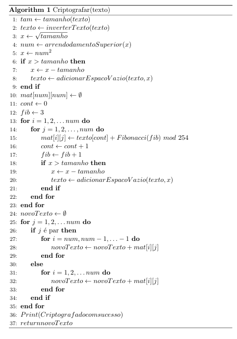

   <h1 align="center">
   Algoritmo de Criptografia e Descriptografaia
  </h1>

  

Algoritmo responsável por criptografar ou descriptografar textos ou arquivos, em caso de criptografar/descriptografar um arquivo, é gerado um arquivo de saída, ao criptografar/descriptografar um texto, a mensagem é exibida no terminal.

- [x] 🔒 Quando é criptografado um arquivo é gerado como saída o arquivo **criptografado.txt**.
- [x] 🔓 Quando é descriptografado um arquivo é gerado como saída o arquivo **descriptografado.txt**.

🧠 A criptografia utilizada faz o uso de transposição matricial e a criptografia de cezar utilizando como chave uma sequência de Fibonacci.

## ✋🏻 Pré-requisitos

1.  Python 3.6
2.  Editor de texto, exemplo vscode.

## 🔥 Instalação e execução

1.  Faça um clone desse repositório;
2.  Entre na pasta `cd master`;
3.  Na pasta ` criptografia` execute no terminal `python3 cripto.py OPÇÃO(-c | -d) [-a ARQUIVO | -t TEXTO`
4.  Na duvida consulta o help `pyhton3 cripto.py -h`
    `-c, --cripto criptografar`
    `-d, --decripto descriptografar`
    `-t, --texto entrada de texto`
    `-a, --arquivo entrada de arquivo`
    `-h, --help mostra esta ajuda e sai`
    `-v, --version informa a versão e sai`

📝**Exemplo**:
`python3 cripto -c -t Teste`
`python3 cripto -d -a criptografado.txt`

## 📒 Documentação

🔶 [Documentação do projeto](https://allainn.github.io/criptografia/build/html/)

   <h2 align="center">
   🔒 Algoritmo de Criptografia 🔒
  </h2>

   <h2 align="center">
   🔓 Algoritmo de Descriptografia 🔓
  </h2>

## ⚡ Como contribuir

- Faça um `fork` desse repositório;
- Cria uma branch com a sua feature: `git checkout -b minha-feature`;
- Faça commit das suas alterações: `git commit -m 'feat: Minha nova feature'`;
- Faça push para a sua branch: `git push origin minha-feature`.

Depois que o `merge` da sua `pull request` for feito, você pode deletar a sua `branch`.

## 👨🏼‍💻 Desenvolvedores

<h4>Allainn Christiam</h4>

<h4>Marcos Alexandre</h4>

